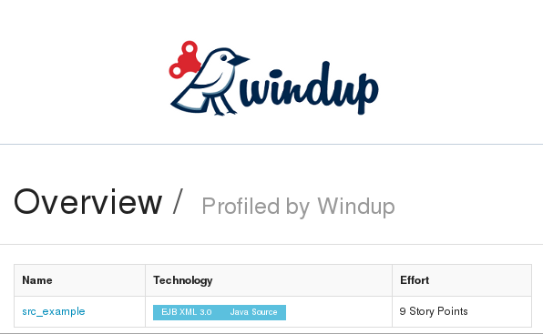
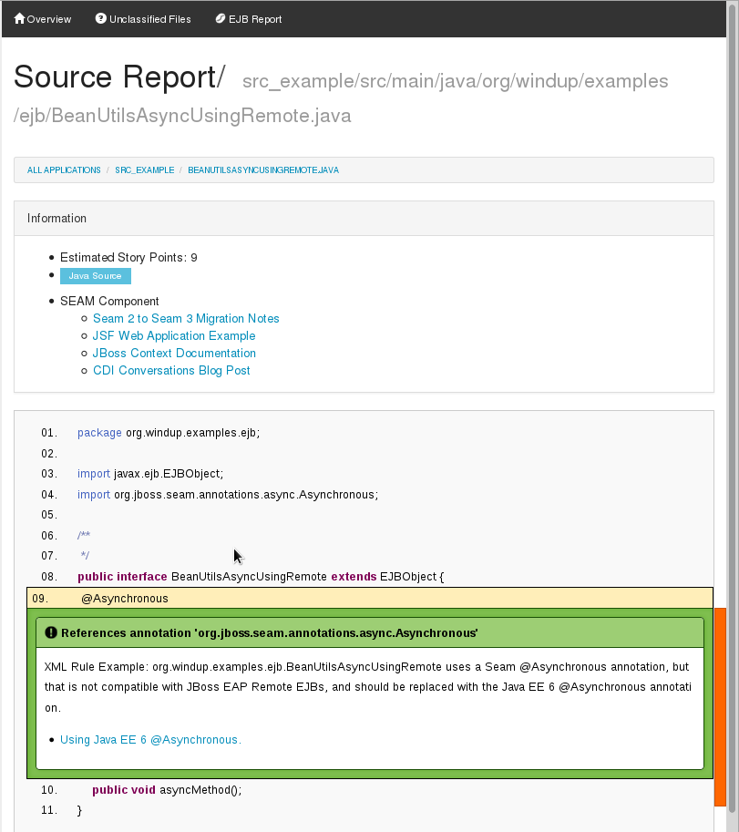

ejb-beanutils-async: XML Rule That Detects Seam Asynchronous Annotation in Remote EJBs
=============================================================================================
Author: Jess Sightler
Level: Intermediate
Technologies: XML rule
Summary: Windup XML-based rule that reports on reports on use of the Seam Asynchronous annotation in remote EJBs
Target Product: Windup
Product Versions: 2.0
Source: <https://github.com/windup/windup-quickstarts/>

What is it?
-----------

The Seam `@Asynchronous` annotation is not compatible with remote EJBs in Red Hat JBoss Enterprise Application Platform. This XML rule tests for use of `org.jboss.seam.annotations.async.Asynchronous` annotations in remote EJBs and reports that it must be replaced with the standard Java EE 6 `@Asynchronous` annotation.

**Note:** Windup only analyzes XML files with names ending in `.windup.xml`. Be sure to name XML-base rules using this naming convention!

Review the Quickstart Code
-------------------------

The `QUICKSTART_HOME/rules-xml/async-method.windup.xml` rule first tests for XML file criteria and the filtered results are then used as input for Java class criteria. The final results are assigned an effort level of 8.

   * The `xmlfile` `<when>` condition tests for XML files with the "ejb" namespace prefix and matching the XPath `/ejb:ejb-jar//ejb:session[windup:matches(ejb:remote/text()`. The `<remote>` element text value is stored in the variable `{{remoteclass}}` for later access by the `javaclass` condition.
   * The `javaclass` `<when>` condition finds instances of the `{{remoteclass}}` named in the filtered results from the `xmlfile` condition, looks for the referenced `org.jboss.seam.annotations.async.Asynchronous` annotation, and saves the results in the variable `asyncUsingSessionBeans`.
   * When the condition is met, the `<perform>` action provides a hint message along with a link to more information and assigns it a level of effort of "8". 

The Windup JavaDoc is located here: <http://windup.github.io/windup/docs/javadoc/latest/>

The Windup rules schema is located here: <https://github.com/windup/windup/blob/master/config-xml/rule-schema.xsd>

System requirements
-------------------

The rule this project produces is designed to be run on Windup 2.0 or later.

This project requires Java 6.0 (Java SDK 1.6) or later and Maven 3.0 or later.

 
Install Windup 2.0
-------------------

If you have not yet done so, [download and intall Windup](https://github.com/windup/windup/wiki/Install-Windup).

Configure Maven
---------------

If you have not yet done so, you must [install and configure Maven](https://github.com/windup/windup/wiki/Install-and-Configure-Maven).

Start Windup
------------

1. Open a terminal and navigate to the `WINDUP_HOME/bin` directory, where `WINDUP_HOME` denotes the path to the Windup installation.

2. Type the following command to start Windup:

        For Linux:    WINDUP_HOME/bin $ ./windup
        For Windows:  C:\WINDUP_HOME\bin> windup

3. You are presented with the following prompt.

        Using Windup at /home/username/windup-distribution-2.0.0.Final
        
         _       ___           __          
        | |     / (_)___  ____/ /_  ______ 
        | | /| / / / __ \/ __  / / / / __ \
        | |/ |/ / / / / / /_/ / /_/ / /_/ /
        |__/|__/_/_/ /_/\__,_/\__,_/ .___/ 
                                  /_/      
        
        JBoss Windup, Final [ 2.0.0.Final ] - JBoss, by Red Hat, Inc. [ http://windup.jboss.org ]
        
        [windup-distribution-2.0.0.Final]$ 

4. This prompt is the Windup console where you enter Windup commands.

Add the Quickstart to Windup
----------------------------

To install the rule in Windup, simply copy the `QUICKSTART_HOME/rules-xml/ejb-beans-utils-async-usage-rule-provider.windup.xml` and `QUICKSTART_HOME/rules-xml/async-method.windup.xml` files into the `WINDUP_HOME/rules` directory.

Test the Quickstart Rule
------------------------

To test this rule, you must run the migration tool against an application that contains the Seam `org.jboss.seam.annotations.async.Asynchronous` annotation. The `src_example` folder located in the `test-files/` directory contains XML and Java class files that can be used to test the rule addon.

1. Start Windup as described above. 

2. Test the rule quickstart application by running the `windup-migrate-app` command at the Windup prompt. 

  The command uses this syntax:

        windup-migrate-app [--sourceMode true] --input INPUT_ARCHIVE_OR_FOLDER --output OUTPUT_REPORT_DIRECTORY --packages PACKAGE_1 PACKAGE_2 PACKAGE_N

   To test this quickstart using the `test-files/src_example/` folder provided in the root directory of this quickstart, type the following commmand. Be sure to replace `QUICKSTART_HOME` with the fully qualified path to this quickstart.
   
        windup-migrate-app -sourceMode true --input QUICKSTART_HOME/test-files/src_example/ --output QUICKSTART_HOME/windup-reports-java --packages org.windup

For more information about how to run Windup, see: [Execute Windup](https://github.com/windup/windup/wiki/Execute-Windup). 

Review the Quickstart Report
----------------------------

1. Open the `QUICKSTART_HOME/windup-reports-xml/index.html` file in a browser.  

   You are presented with the following index page.  

  
2. Click on the `src_example` link.  

   This opens an overview page showing a total of 9 story points and the list of the relevant files along with the warning messages, links to obtain more information, and the estimated story points for each item.  

*src/resources/sample-ejb-jar.xml* shows 0 story points

       
*org.windup.examples.ejb.BeanUtilsAsyncUsingRemote* show 9 story points

        4 points, 2 points for each of the two @WLInitParam references
        9 points for References annotation 'org.jboss.seam.annotations.async.Asynchronous'

  
3. Click on the file links to drill down and find more information.  

* The **Information** section reports on the matching conditions and provides a link to the standard Java EE servlet annotation documentation.

* This is followed by the source code matching the condition with a detailed message desription.

  

Remove the Quickstart Rule from Windup
---------------------------------

To remove the rule from Windup, simply delete the `WINDUP_HOME/rules/async-method.windup.xml` file from the `WINDUP_HOME/rules` directory.

Stop Windup
-----------

To stop Windup, type the following command in the Windup console:

        exit

