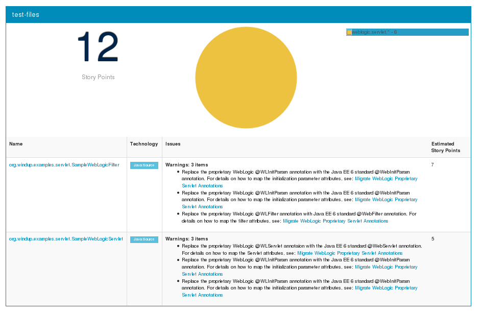

weblogic-javaee-servlet: XML-based Rule That Detects WebLogic Proprietary Servlet Annotations
=============================================================================================
Author: Windup Team  
Level: Beginner  
Technologies: XML-based rule
Summary: Windup XML-based rule that reports on WebLogic servlet annotations  
Target Product: Windup  
Product Versions: 2.0  
Source: <https://github.com/windup/windup-quickstarts/>  

What is it?
-----------

WebLogic provides its own proprietary servlet and filter annotations for dependency injection. If the application uses them, they must be replaced with the standard Java EE 6 annotations. This example demonstrates how to create a WindupRuleProvider that searches for these proprietary annotations and reports on them.

This XML-based Windup rule searches for the following annotations:

* *@WLServlet*: This is the equivalent of the Java EE 6 *@WebServlet* annotation.

* *@WLFilter*: This is the equivalent of the Java EE 6 *@WebFilter* annotation.

* *@WLInitParam*: This is the equivalent of the Java EE 6 *@WebInitParam* annotation.

**Note:** Windup only analyzes XML files with names ending in `.windup.xml`. Be sure to name XML-base rules using this naming convention!

Review the Quickstart Code
-------------------------

The QUICKSTART_HOME/rules-xml/my-hints-rule-provider.windup.xml ruleset contains 3 rules. Each rule tests for a Java class reference to a WebLogic servlet annotation and provides a message about to migrate the code.

* A `<rule>` elements is defined for each of the above WebLogic Servlet annotations. Each `rule` contains the following elements.
* The `<when>` looks for a `javaclass` for the specific WebLogic annotation, for example, `weblogic.servlet.annotation.WLServlet`, `weblogic.servlet.annotation.WLInitParam`, or `weblogic.servlet.annotation.WLFilter`, with a location `ANNOTATION`.
* On a match, the `<perform>` element provides a `<hint>` message and description with links to documentation.

The Windup Javadoc is located here: <http://windup.github.io/windup/docs/javadoc/latest/>

System requirements
-------------------

The rule this project produces is designed to be run on Windup 2.0 or later.

This project requires Java 6.0 (Java SDK 1.6) or later and Maven 3.0 or later.

 
Install Windup 2.0
------------------

If you have not yet done so, follow the instructions to [Download and install Windup](https://github.com/windup/windup/wiki/Install-Windup).

Start Windup
------------

1. Open a terminal and navigate to the `WINDUP_HOME/bin` directory, where `WINDUP_HOME` denotes the path to the Windup installation.

2. Type the following command to start Windup:

        For Linux:    WINDUP_HOME/bin $ ./windup
        For Windows:  C:\WINDUP_HOME\bin> windup

3. You are presented with the following prompt.

        Using Windup at /home/username/windup-distribution-2.0.0.Beta4
        
         _       ___           __          
        | |     / (_)___  ____/ /_  ______ 
        | | /| / / / __ \/ __  / / / / __ \
        | |/ |/ / / / / / /_/ / /_/ / /_/ /
        |__/|__/_/_/ /_/\__,_/\__,_/ .___/ 
                                  /_/      
        
        JBoss Windup, version [ 2.0.0.Beta4 ] - JBoss, by Red Hat, Inc. [ http://windup.jboss.org ]
        
        [windup-distribution-2.0.0.Beta4]$ 

4. This prompt is the Windup console where you enter Windup commands.

Add the Quickstart to Windup
----------------------------

To install the rule in Windup, simply copy the `QUICKSTART_HOME/rules-xml/my-hints-rule-provider.windup.xml` file into the `WINDUP_HOME/rules` directory.

Test the Quickstart Rule
------------------------

This quickstart provides an example source file containing WebLogic annotations to use when testing the quickstart. It is located in this quickstart's `test-files/src_example/` directory.

1. If you have not started Windup, follow the instructions above to [Start Windup](#start-windup).

2. Test the XML-based rule against the WebLogic application file by running the `windup-migrate-app` command at the Windup prompt. 

  The command uses this syntax:

        windup-migrate-app [--sourceMode true] --input INPUT_ARCHIVE_OR_FOLDER --output OUTPUT_REPORT_DIRECTORY --packages PACKAGE_1 PACKAGE_2 PACKAGE_N

  To test this quickstart using the `test-files/src_example/src/main/java/org/windup/examples/servlet/SampleWebLogicServlet.java` example file provided in the root directory of this quickstart, type the following commmand. Be sure to replace `QUICKSTART_HOME` with the fully qualified path to this quickstart.
    
        windup-migrate-app --sourceMode true --input QUICKSTART_HOME/test-files/src_example/ --output QUICKSTART_HOME/windup-reports-xml --packages org.windup

  You should see the following result:
 
        ***SUCCESS*** Windup report created: QUICKSTART_HOME/windup-reports-xml/index.html
                      Access it at this URL: file:///QUICKSTART_HOME/windup-reports-xml/index.html
  
For more information about how to run Windup, see: [Execute Windup](https://github.com/windup/windup/wiki/Execute-Windup). 

Review the Quickstart Report
----------------------------

1. Open the `QUICKSTART_HOME/windup-reports-xml/index.html` file in a browser.  

   You are presented with the following index page.  

  
2. Click on the `src_example` link.  

   This opens an overview page showing a total of 9 story points and the list of the relevant files along with the warning messages, links to obtain more information, and the estimated story points for each item.  

*src/resources/sample-ejb-jar.xml* shows 0 story points

       
*org.windup.examples.ejb.BeanUtilsAsyncUsingRemote* show 9 story points

        4 points, 2 points for each of the two @WLInitParam references
        9 points for References annotation 'org.jboss.seam.annotations.async.Asynchronous'

  
3. Click on the file links to drill down and find more information.  

* The **Information** section reports on the matching conditions and provides a link to the standard Java EE servlet annotation documentation.

* This is followed by the source code matching the condition with a detailed message desription.

  

Remove the Quickstart from Windup
---------------------------------

To remove the rule from Windup, simply delete the `WINDUP_HOME/rules/my-hints-rule-provider.windup.xml` file `WINDUP_HOME/rules` directory.

Stop Windup
-----------

To stop Windup, type the following command in the Windup console:

        exit

